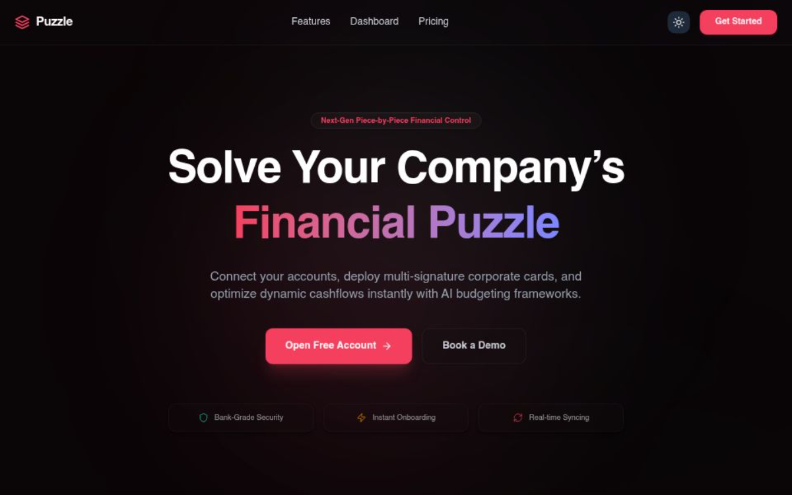

# 🧩 Puzzle — Immersive B2B Fintech Landing Page

<div align="center">
  
</div>

An elite, high-performance financial operations landing page engineered for fast-scaling operational teams. This project demonstrates advanced front-end orchestration, custom inertial scroll physics, layout state synchronization, and highly interactive micro-interactions designed to mimic industry leaders like Stripe and Linear.

## 🔗 Live Production Deployment
🚀 **[Launch Live Interactive Demo](https://puzzle-fintech-landing.vercel.app/)**

---

## ⚡ Key Engineering & Interaction Highlights

* **🔒 Universal Custom Cursor Lock:** Built a completely custom canvas-trailing cursor utilizing Framer Motion spring physics. Engineered explicit CSS wildcard overrides and runtime fallback execution loops to completely isolate and suppress native OS cursors across all dynamic frames, lazy-loaded structures, and SVG elements.
* **📐 3D Parallax Credit Card Mechanics:** Implemented a full mouse-tracking 3D coordinate script mapping matrix onto the primary bento component. Utilizing nested `translateZ` spatial dimensions, interactive elements visually project outward off the plastic card asset layer, responding dynamically to real-time pointer coordinates.
* **📡 Scroll-Driven Typewriter Terminal:** Integrated an efficient native React character rendering typewriter engine wrapper. Triggered by a localized `IntersectionObserver` configuration, the structural API code block simulates developer console execution inputs the exact millisecond it surfaces into the scroll frame viewport.
* **📈 Kinetic Viewport Counter Ticker:** Engineered a localized metric layout ticker utilizing custom frame timing loops. When scrolled into view, the dashboard values accelerate smoothly from `0.0%` to `99.9%` mapped safely with `tabular-nums` formatting constraints to prevent text layout shaking.
* **🧭 Smart Hide-On-Scroll Sticky Navbar:** Hooked Framer Motion's `useScroll` directly to structural animation states. The navigation bar smoothly hides when scrolling down to maximize user focus, and instantly glides down upon a subtle scroll-up frame tick.

---

## 💻 Technical Architecture Stack

* **Core Framework:** React 19 + Vite (Highly optimized HMR configurations)
* **Styling Framework:** Tailwind CSS v4 (Theme token layers + native color-mix utilities)
* **Animation Engines:** Framer Motion (Orchestration variants + layout animation maps)
* **Scroll Engine:** Lenis Smooth Scroll (Damped inertial kinetic scrolling loops)
* **Iconography Canvas:** Lucide React (Clean vector infrastructure icons)

---

## 🛠️ Local Development Installation

If you want to run this fintech template layout locally, execute the following script sequence in your terminal:

```bash
# 1. Clone the master repository branch
git clone https://github.com/MicroD3v/puzzle-fintech-landing.git

# 2. Enter into the project folder directory
cd puzzle-fintech-landing

# 3. Install clean, unified node package dependencies
npm install

# 4. Boot up the high-performance Vite local development server
npm run dev
```
